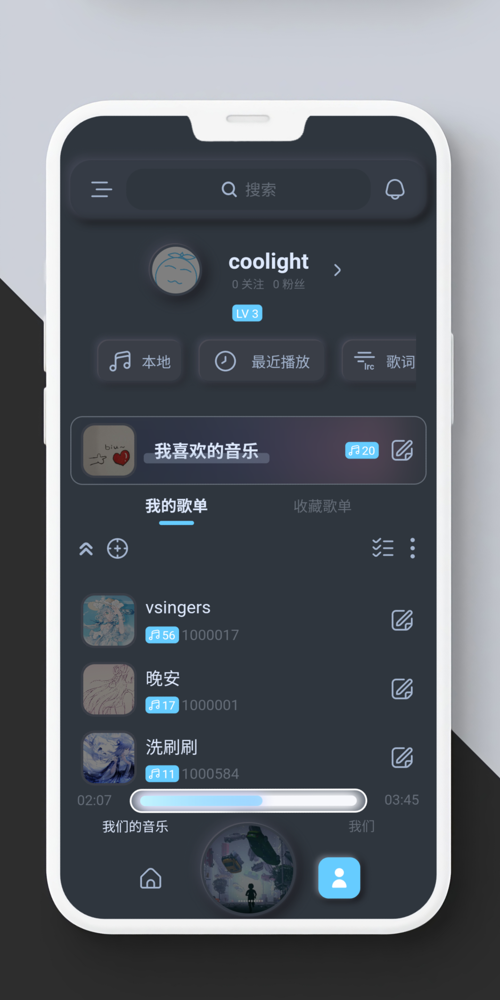
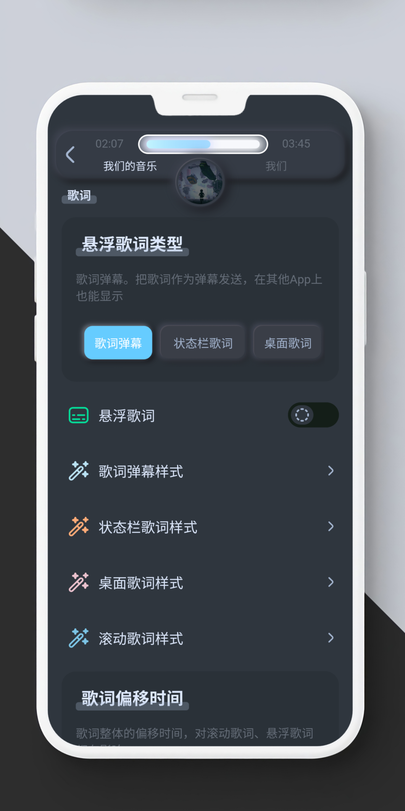

# Musicxx 拟声
* [官网](https://blog.mimicry.cool/)
* [下载官网](https://download.music.mimicry.cool/)
* [GitHub](https://github.com/coolight7/MimicryMusic)

## 简介
* 新拟物风格的 音视频播放器
* 后端：
  * c++，基于搜狗开源的 [workflow](https://github.com/sogou/workflow) 开发
  * workflow 的任务流设计能把回调也变得简单易懂，c++中不可多得的异步框架，跨平台；支持 http、rpc、mysql 等网络开发和计算任务调度，你值得拥有！
* 客户端：
  * flutter
  * 支持[安卓]、[windows]、[mac]、[linux]；允许多端同时登录账号，并将自动同步 歌单、歌词、webdav连接 等
  * 支持播放 bili 歌曲、本地音乐、音乐文件链接、webdav、阿里云盘、百度云盘，拥有内置音乐云盘
  * 支持播放绝大多数格式；支持视频MV、Anime4K 实时画质提升、逐帧播放
  * 支持歌词弹幕、状态栏歌词、桌面歌词，高容错的歌词解析能力，支持歌词制作、显示翻译歌词等
  * 拟物、扁平，多种风格主题，并支持 跟随系统、跟随时间 切换；支持自定义背景图、天气背景
  * 丰富的自定义功能：真/伪随机播放、自定义App启动位置、启动时自动播放、方形封面、网格布局
  * QQ注册/登录

## 预览图
| - | - | - | - | - |
| ------ | ------ | ------ | ------ | ------ |
|  |  | |  |  |

## 支持平台：
- android (安卓4.1及以上，arm64-v8a/armeabi-v7a/x86_64)
- windows (Win10及以上，x86_64)
- macos（Macos11及以上，arm64/x86_64）
- linux（arm64/x86_64）