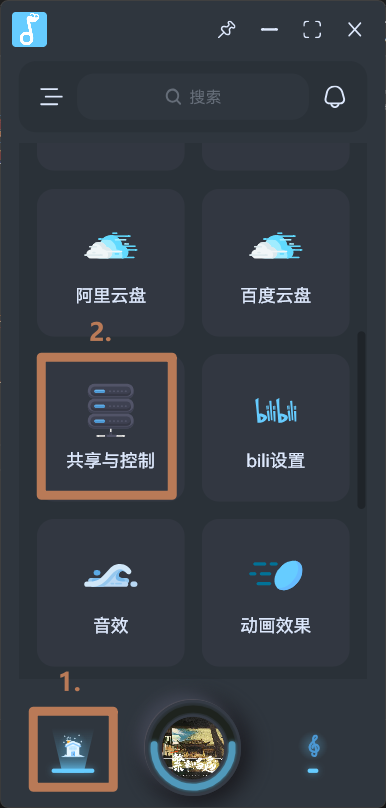
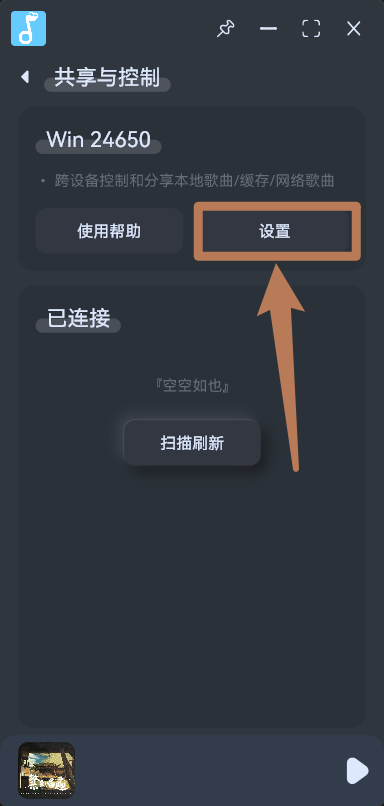
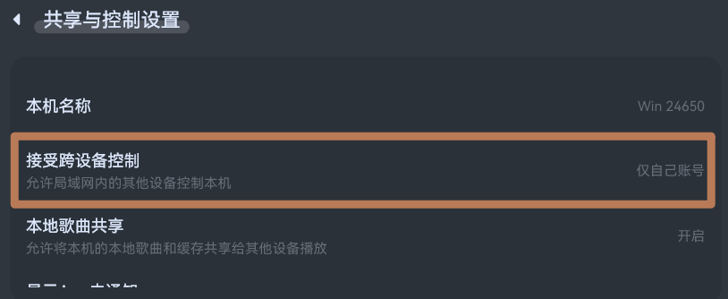
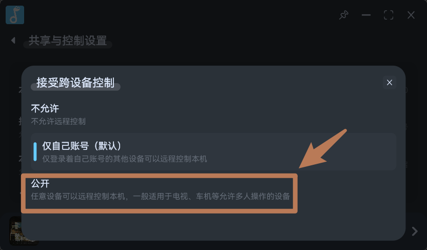

# 车机使用指南
- 大部分车机仍然是安卓系统，因此您可以尝试下载安装[拟声的安卓版](https://download.music.mimicry.cool/)，安卓端分为多种架构，可以依次尝试 `arm64`、`arm32`、`x64`，如果不能安装或是启动闪退再尝试下一个架构。

## 便捷登录
- [拟声密令登录](/help/user/xxcodeSign/)

## 拟声远程控制
- [共享与控制](/help/plguins/share/)
- 在其他设备，如手机、电脑上安装拟声，并且双方都安装插件`共享与控制`后，即可互相控制和共享歌曲。
- 默认情况下，`共享与控制`仅允许登录相同账号的设备可以互相控制，您可以用修改插件设置项的`接收跨设备控制`控制权限为`公开`, 即可让其他设备连接控制：

- 点击`设置`：

- 点击`接收跨设备控制`：

- 选择`公开`:
