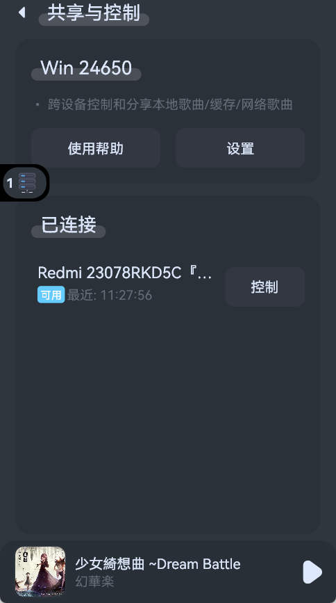
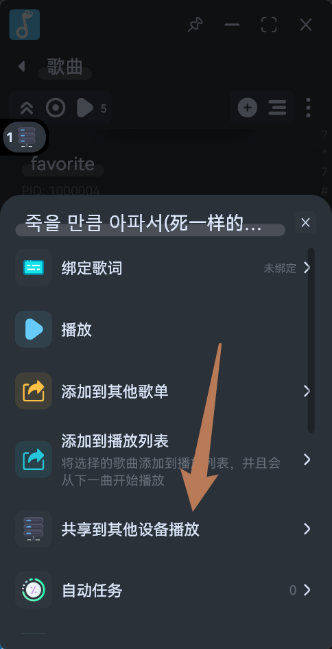
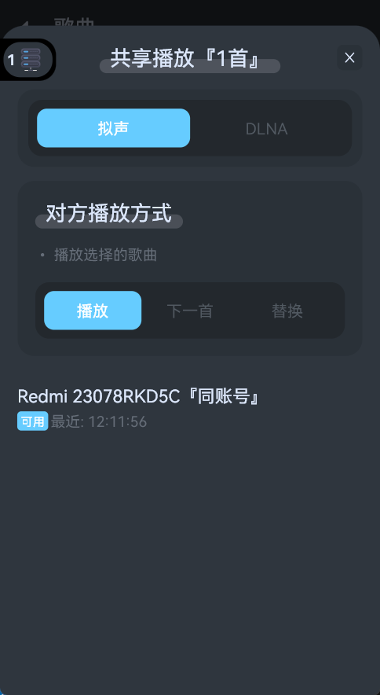

# 共享与控制
- 拟声核心功能之一，该插件效果强大，可实现跨设备共享播放、远程控制等功能。
- 需要附近设备在同一局域网内，比如连接同一 WIFI、热点等。
- 已支持`拟声私有通信协议`和`DLNA`，其中`拟声私有通信协议`由于完全出自拟声开发，支持的功能相当全面且强大。

## 安装
- 在`拟声`的`插件管理`中安装`共享与控制`：

## 使用帮助

### 远程控制
- 首先插件页面会显示附近可用设备，以及当前设备的名称，方便其他设备连接，也可以下拉扫描附近设备。
- 默认情况下，两个设备登录相同账号，且安装插件`共享与控制`后就会显示：

- 如图中，附近有一个设备登录着相同账号，可点击`控制`连接它：

### 自动共享
- 除了主动连接进行远程控制，该插件还支持自动共享本地歌曲、缓存给其他设备播放。
- 这意味着：
    - 对于`本地歌曲`，假设主要存放电脑上，而手机、电视等其他设备需要播放时，拟声会自动将电脑上的歌曲文件共享传输到当前设备上播放。
    - 对于`缓存`，如果即将播放需要网络加载的歌曲，而局域网内的其他设备已经有了这个歌曲的缓存文件，拟声同样会自动共享过来播放，即可大幅节约流量并提高加载速度。如果您的网盘是按流量计费，利用这个功能可实现多台设备播放时，实际只消耗了一次歌曲文件流量。
    - 另外，`以上两个功能还会互相结合`，假如家里电脑上的本地歌曲共享到了手机上播放，此时手机会将该文件认为是`缓存`，带着手机来到公司时，公司的电脑也没有该歌曲文件，但会将手机上的缓存共享过来播放。
- 效果强大且无需用户额外操作，只需要安装该插件即可。

### 分享播放
- 安装该插件后，在大多数的`歌单`、`歌曲`右边的三个点中，会出现`共享到其他设备播放`功能：

- 可选择单首歌曲、多首歌曲、整个歌单、多个歌单分享到其他设备播放。

### 相关设置
