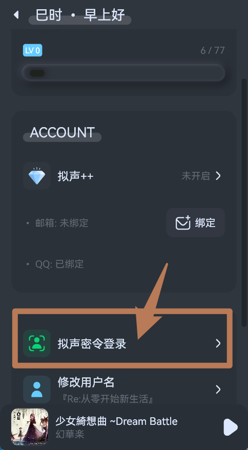

# 拟声密令登录
- `拟声密令`用于方便已登录拟声的设备在其他设备上登录
- 由于手机上登录拟声往往比较方便，其他设备如电视、车机登录账号比较麻烦，因此可以利用`拟声密令`，在手机上允许其他设备登录账号
- 登录账号需要网络连接，请确保两个设备上的网络连接正常

## 待登录端
- 打开拟声，进入`登录页面`，点击`拟声密令`，即可获取登录密令：

- 如果密令过期，点击`刷新密令`即可：

- 接下来`待登录端`无需操作，请使用`已登录的设备`进行下一步操作

## 已登录端
- 打开拟声，进入用户信息页面：

- 点击`拟声密令登录`：

- 输入待登录端的密令，点击`确定`即可：

- 然后会读取显示对方的设备信息，确认设备正确即可点击`允许登录`，待登录端将会自动登录：
